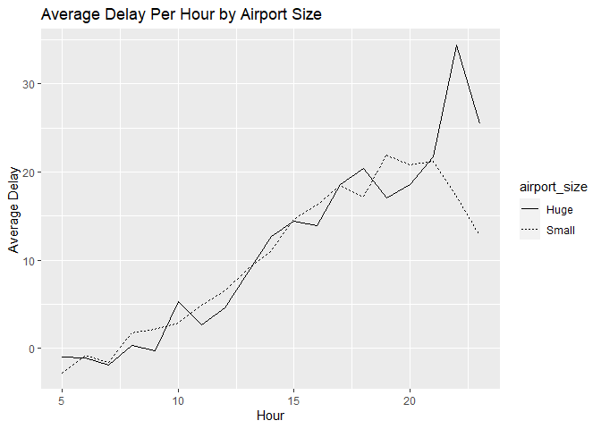
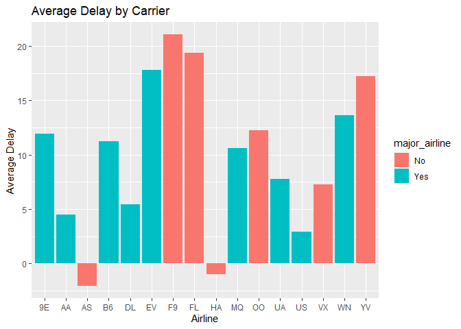
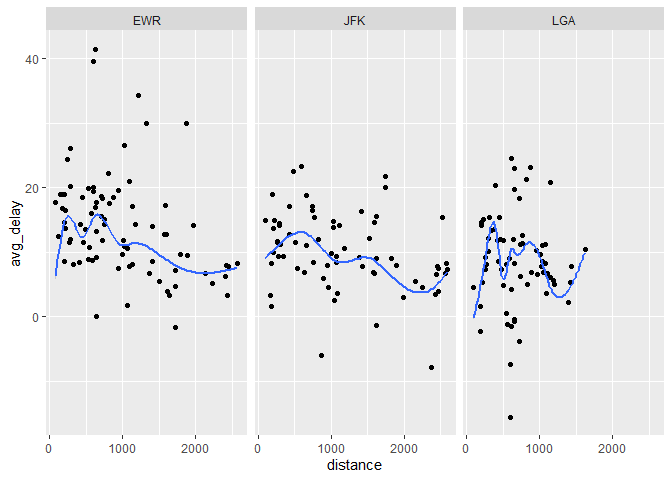
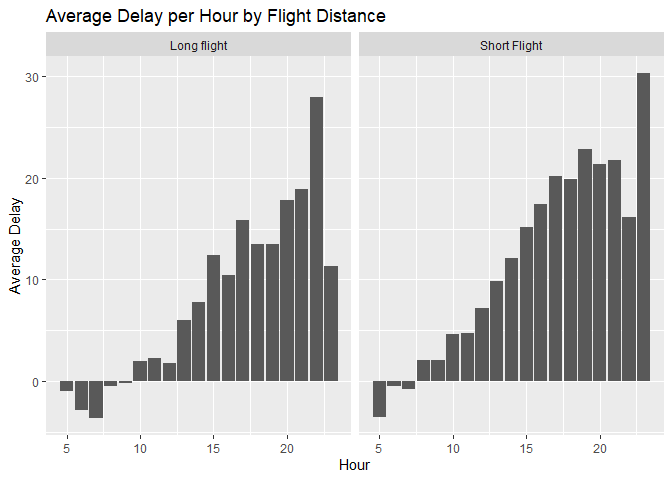

Homework 3
================
Robert George
10/5/2021

# Homework 3

## Robert George

### Description

In this project, we looked at three variables that we thought would
influence flight delays. The size of the destination airport, the
airline carrying the flight, and the distance of the flight were all
considered in determining the best time of day to schedule a flight in
order to avoid delays. Our findings, however, are somewhat lackluster;
we found that regardless of the variable considered, flights in the
early morning are consistently more on time. Ultimately, our decision
not to consider flight cancellations, for the ease of being able to drop
them and look at delay times, may have had a greater influence on our
results than we had expected. Given that large airlines and airports are
probably more likely to cancel flights, this would lower their overall
delay times.

    ## -- Attaching packages --------------------------------------- tidyverse 1.3.1 --

    ## v ggplot2 3.3.5     v purrr   0.3.4
    ## v tibble  3.1.4     v dplyr   1.0.7
    ## v tidyr   1.1.3     v stringr 1.4.0
    ## v readr   2.0.1     v forcats 0.5.1

    ## -- Conflicts ------------------------------------------ tidyverse_conflicts() --
    ## x dplyr::filter() masks stats::filter()
    ## x dplyr::lag()    masks stats::lag()

    ## ## FSA v0.9.1. See citation('FSA') if used in publication.
    ## ## Run fishR() for related website and fishR('IFAR') for related book.

### Setting the stage

First, let’s take a look at what time of day there are the fewest
delays, by aggregating delay times into one variable that represents the
overall mean delay time per hour of the day. This way we can see if
targeting specific explanatory variables changes the baseline for the
best time of day to fly.

    ## # A tibble: 5 x 4
    ##    hour mean_arr_delay mean_dep_delay avg_delay
    ##   <dbl>          <dbl>          <dbl>     <dbl>
    ## 1     5          -4.80          0.689    -2.05 
    ## 2     7          -5.30          1.91     -1.70 
    ## 3     6          -3.38          1.60     -0.895
    ## 4     8          -1.11          4.11      1.50 
    ## 5     9          -1.45          4.54      1.54

We can see that without manipulating any variables, early morning
flights have the shortest delays across the board. Dropping missing
values (canceled flights), we see that flights leaving between 5 and 6
AM have the lowest average delay, leaving approximately 2 minutes early
on average. To test the impact of certain explanatory variables on the
average delay per hour, we will be looking at three factors of flights
that would influence delay times. Because delays are often due to
logistical importance, situations in which Air Traffic Control have to
delay a flight so that another can get off the runway safely, I
hypothesize that the busiest airports will boast the longest delays. To
test this, I will create a dummy variable coded “Huge” if the
destination airport is one of the ten busiest airports in the country,
and coded “Small” if it is not. Another major factor that influences
flight delays is weather. Because it would be too difficult to filter
the dataset by region with only the airport postal codes, I will instead
look at airline to determine the impact of weather, due to the fact that
certain airlines sponsor flights in specific regions, with Southwest
Airlines hosting flights in the most averse geographic conditions.
Another good reason to look at the effect of airline choice against
delay times is that I expect smaller airlines to have longer delay
times, because they have less frequent trips between two different
airports, meaning a delayed flight will be delayed substantially longer
for a smaller airline. Finally, to investigate further the impact of
weather on delays, I will look at flight length, asserting that longer
flights have a higher chance of interacting with averse weather. I have
no way of testing this, however, because the available weather data is
only for the departure airport, which would not have any special effect
on a long flight versus a short one.

### Airport size

To begin, we need to create a dummy variable indicating the size of the
destination airport. According to <https://airadvisor.com>, the 10
largest airports in the USA are as follows: DEN, DFW, MCO, IAD, IAH,
SLC, ORD, SFO, JFK, DTW. Our dummy variable, airport\_size, will be
coded “Huge” for these airports and “Small” for all other airports.

``` r
big_airports = c("DEN","DFW", "MCO", "IAD", "IAH", "SLC", "ORD", "SFO", "JFK", "DTW")
flights = flights%>%
  mutate(airport_size = case_when(dest %in% big_airports ~ "Huge",
                                  TRUE ~ "Small"))
```

<!-- -->

    ## # A tibble: 2 x 2
    ##   airport_size avg_delay
    ##   <chr>            <dbl>
    ## 1 Huge              8.71
    ## 2 Small            10.1

Early morning flights have the lowest average delays regardless of the
size of the airport a plane is departing from or heading to. There does
not appear to be much evidence to suggest a relationship between
destination airport size and delay times. We could consider that the
average delay across all flights going to a huge airport is actually
lower than those going to a small airport. Flights between New York and
major airports are, obviously, far more frequent than those to regional
airports. Therefore, we could explain this by positing that we are not
considering cancellations; that flights between large airports are more
often cancelled than allowed to delay.

### Airline

Next, we will examine the effect of airline carrier on delay times.
First we will examine the best times to leave to minimize delays, to see
if there is any variation with our original hypothesis. Then, we will
investigate whether there is a relationship with general delay times and
airline carrier. Finally, we will examine our results and derive
conclusions.

    ## # A tibble: 16 x 3
    ##    carrier  Time `Lowest average delay`
    ##    <chr>   <dbl>                  <dbl>
    ##  1 US          5                 -4.77 
    ##  2 EV          6                  3.41 
    ##  3 MQ          6                  0.394
    ##  4 UA          6                 -2.41 
    ##  5 AA          7                 -4.72 
    ##  6 AS          7                 -9.92 
    ##  7 B6          7                 -0.811
    ##  8 F9          7                -13    
    ##  9 FL          7                 -1.12 
    ## 10 WN          8                 -0.731
    ## 11 9E         10                 -1.97 
    ## 12 HA         10                 -4.96 
    ## 13 VX         12                -16.7  
    ## 14 OO         17                 -1    
    ## 15 YV         18                -12    
    ## 16 DL         23                 -5.69

Most flights with the lowest delays are still morning flights when you
group by airline. Regional, small airlines like Hawaiian and Endeavor
have lower delays on flights leaving later in the morning.

<!-- -->

The longest average delays occur with airlines that are either smaller
airlines or are regionally located in the southwest. ExpressJet and
Southwest airlines are the two major airlines with the highest delays by
far, and both service mostly the southwest of the USA. The other four
airlines with the highest delay times are small airlines with under
10,000 completed flights in 2013. This could be explained by the notion
that larger airlines have more frequent flights, so they might be more
willing to cancel flights and reassign passengers to later flights than
smaller airlines who would lose more money cancelling flights.

### Flight Distance

Is there a relationship between flight distance and average delay?

    ## `geom_smooth()` using method = 'gam' and formula 'y ~ s(x, bs = "cs")'

<!-- --> It seems that
my hypothesis was entirely incorrect. There seems to be a negative
relationship between flight distance and average delay, rather than a
positive one.

Is there a relationship between time of day and delays, considering
flight length? We begin by splitting the flight distances into four
quantiles. We create another dummy variable that indicates a long flight
for any distance longer than the third quantile of the data, and a short
flight for all other flights. We examine the best time of day to leave
to avoid delays, faceting for flight length.

    ##   0%  25%  50%  75% 100% 
    ##   17  502  872 1389 4983

<!-- --> We can see
that the trend of flight delays increasing in time as the day goes on is
consistent regardless of the length of the flight. We can see that
longer flights actually tend to have shorter delays, however, we have
not included information on flight cancellations in any of our
calculations. Therefore, we may be omitting an important factor; long
flights might get canceled more frequently than short flights, which may
just get delayed.
